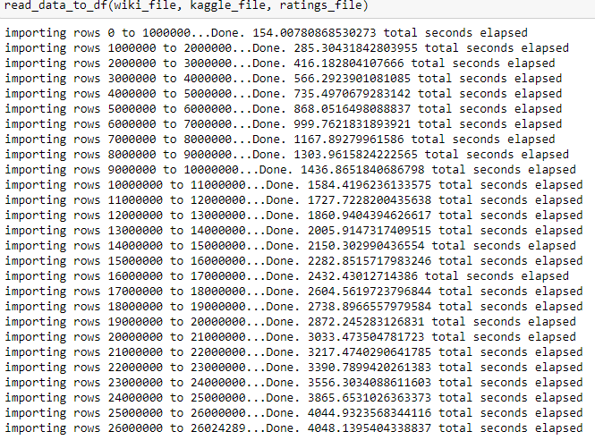
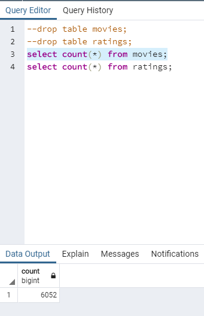
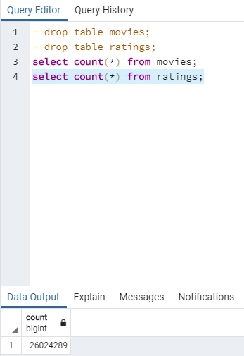

# Movies-ETL
For this project we are creating an automated pipeline that takes in new data, performs the appropriate transformations, and loads the data into existing tables. A function that takes in the three files - Wikipedia data, Kaggle metadata, and the MovieLens rating data, and performs the ETL process by adding the data to a PostgreSQL database.
 
## Resources:
 - Data Source: movies_metadata.csv, ratings.csv, wikipedia.movies.json
 - Software: anaconda3, python 3.7.7, jupyter notebook
 - Library: pandas, numpy, re, json, sqlalchemy, and time 

## Module Project Overview
During the module steps were done to extract, transform and load the data to Postgres database.

## Challenge Overview
For challenge project, the code was refactored into a function to extract, clean, transform, and load the data to Postgres Database.

Total time it took to upload is shown below along with the final record count of two tables that are created in Postgres database 'movie_data', tables movies and ratings.

